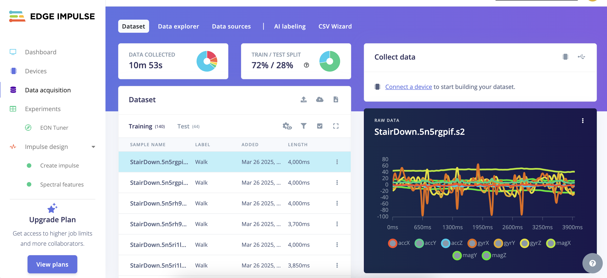
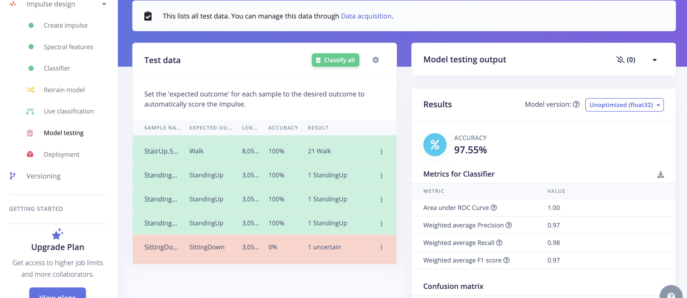

# Deploying a TinyML Model on Arduino Nano 33 BLE Using Edge Impulse

## Index

1. [Setting Up Edge Impulse and Connecting Arduino](#1-setting-up-edge-impulse-and-connecting-arduino)

   1.1 [Creating an Edge Impulse Account](#11-creating-an-edge-impulse-account)

   1.2 [Installing Required Software](#12-installing-required-software)

   1.3 [Connecting Arduino Nano 33 BLE](#13-connecting-arduino-nano-33-ble)

2. [Data Collection](#2-data-collection)

3. [Creating an Impulse](#3-creating-an-impulse)

   3.1 [Setting Up the Impulse](#31-setting-up-the-impulse)

   3.2 [Choosing the Processing Block](#32-choosing-the-processing-block)

   3.3 [Selecting the Learning Block](#33-selecting-the-learning-block)

   3.4 [Output Features](#34-output-features)

4. [Model Training](#4-model-training)

5. [Model Testing](#5-model-testing)

6. [Deploying the Model to Arduino](#6-deploying-the-model-to-arduino)

   6.1 [Exporting the Model](#61-exporting-the-model)

   6.2 [Adding the Library to Arduino IDE](#62-adding-the-library-to-arduino-ide)

   6.3 [Uploading the Model](#63-uploading-the-model)

   6.4 [Monitoring the Output](#64-monitoring-the-output)

7. [Running the Model Independently on Arduino](#7-running-the-model-independently-on-arduino)

<!-- 1. [Setting Up Edge Impulse and Connecting Arduino](#setting-up-edge-impulse-and-connecting-arduino)
   1.1 [Creating an Edge Impulse Account](#creating-an-edge-impulse-account)  
   1.2 [Installing Required Software](#installing-required-software)  
   1.3 [Connecting Arduino Nano 33 BLE](#connecting-arduino-nano-33-ble)  
2. [Data Collection](#data-collection)  
3. [Creating an Impulse](#creating-an-impulse)  
   3.1 [Setting Up the Impulse](#setting-up-the-impulse)  
   3.2 [Choosing the Processing Block](#choosing-the-processing-block)  
   3.3 [Selecting the Learning Block](#selecting-the-learning-block)  
   3.4 [Output Features](#output-features)  
4. [Model Training](#model-training)  
5. [Model Testing](#model-testing)  
6. [Deploying the Model to Arduino](#deploying-the-model-to-arduino)  
   6.1 [Exporting the Model](#exporting-the-model)  
   6.2 [Adding the Library to Arduino IDE](#adding-the-library-to-arduino-ide)  
   6.3 [Uploading the Model](#uploading-the-model)  
   6.4 [Monitoring the Output](#monitoring-the-output)  
7. [Running the Model Independently on Arduino](#running-the-model-independently-on-arduino) -->

## Introduction
Falls can be dangerous, especially for elderly individuals or people with mobility issues. In this tutorial, we will build a fall detection system using Arduino Nano 33 BLE and Edge Impulse, enabling real-time motion classification with TinyML.

### Why Use TinyML for Fall Detection?
Traditional fall detection systems rely on cloud computing, which can introduce latency and privacy concerns. With TinyML, we can deploy a machine learning model directly on the Arduino board, allowing it to process sensor data locally and detect falls instantly.

### How Does It Work?
- **Data Collection**: We gather motion data using the accelerometer, gyroscope, and magnetometer sensors on the Arduino Nano 33 BLE.
- **Feature Extraction & Model Training**: Using Edge Impulse, we extract useful features from the sensor data and train a classification model to differentiate between activities such as walking, falling, sitting, and standing.
- **Model Deployment**: The trained model is exported as an Arduino library and uploaded to the board.
- **Real-Time Fall Detection**: Once deployed, the Arduino runs the model independently, classifying movements and detecting falls in real time.

This guide will walk you through the entire process, from setting up Edge Impulse to deploying the model on Arduino.

## Arduino Nano 33 BLE

*Image Source: [store.arduino.cc](https://store.arduino.cc/en-nl/products/arduino-nano-33-ble?srsltid=AfmBOooJoCwlvWTNCuk-RsU_MO-ghecBr_MLgLGFA8n9oIKQNpXtn43y)*

The Arduino Nano 33 BLE is a tiny development board with a Cortex-M4 microcontroller, motion sensors, and BLE - and it's fully supported by Edge Impulse. You'll be able to sample raw data, build models, and deploy trained machine learning models directly from the studio.


## Edge Impulse

*Image Source: [edgeimpulse.com/](https://www.edgeimpulse.com/blog/getting-started-with-edge-impulse/)*

Edge Impulse is a machine learning platform designed for embedded devices like Arduino, Raspberry Pi, and other microcontrollers. It allows users to easily collect sensor data, train models, and deploy them directly to edge devices for real-time inference.

With Edge Impulse, you can:
- Collect and label sensor data (e.g., motion, audio, temperature)
- Train TinyML models optimized for low-power devices
- Deploy models directly to microcontrollers without needing cloud processing

It’s widely used for applications like fall detection, sound classification, gesture recognition, and predictive maintenance.

## 1. Setting Up Edge Impulse and Connecting Arduino

### 1.1 Creating an Edge Impulse Account
Go to [Edge Impulse Studio](https://studio.edgeimpulse.com/signup) and create a free account.


### 1.2 Installing Required Software
To set this device up in Edge Impulse, you will need to install the following software:
- Edge Impulse CLI.
- Arduino CLI.

Here's an instruction video for [Windows](https://www.edgeimpulse.com/docs/cli/windows).

The Arduino website has instructions for macOS and Linux.

### 1.3 Connecting Arduino Nano 33 BLE
With all the software in place, it's time to connect the development board to Edge Impulse.
1. Connect the development board to your computer using a Micro-USB cable.
2. Press RESET twice to launch into the bootloader. The on-board LED should start pulsating to indicate this.
3. Press RESET twice quickly to launch the bootloader on the Arduino Nano 33 BLE.


*Image Source: [docs.edgeimpulse](https://docs.edgeimpulse.com/docs/edge-ai-hardware/mcu/arduino-nano-33-ble-sense)*

#### Update the firmware
The development board does not come with the right firmware yet. To update the firmware:
1. Download the latest Edge Impulse firmware and unzip the file.
2. Open the flash script for your operating system (`flash_windows.bat`, `flash_mac.command`, or `flash_linux.sh`) to flash the firmware.
3. Wait until flashing is complete, and press the RESET button once to launch the new firmware.

#### Setting keys
From a command prompt or terminal, run:
```bash
edge-impulse-daemon
```
This will start a wizard which will ask you to log in and choose an Edge Impulse project. If you want to switch projects, run the command with `--clean`.

Alternatively, recent versions of Google Chrome and Microsoft Edge can collect data directly from your development board, without the need for the Edge Impulse CLI. See this [blog post](https://edgeimpulse.com/blog/collect-sensor-data-straight-from-your-web-browser/).

#### Verifying that the device is connected
That's all! Your device is now connected to Edge Impulse. To verify this, go to your Edge Impulse project, and click Devices. The device will be listed here.


## 2. Data Collection
- Open Edge Impulse Studio and create a new project.
- Navigate to the Data Acquisition section and collect labeled data using Arduino sensors.



### 2.1 Types of Incoming Data
- **Accelerometer**: Measures linear acceleration.
- **Gyroscope**: Detects rotational motion.
- **Magnetometer**: Captures magnetic field variations.

## 3. Creating an Impulse

In this step, we define how our model processes and learns from data.


### 3.1 Setting Up the Impulse
Go to Impulse Design in Edge Impulse Studio.

Set the following parameters:
- **Window size**: Defines the duration of each data sample. (e.g., 1000 ms means each sample contains 1 second of sensor readings). We have chosen 4000 ms because all of our data size is 4000 ms.
- **Frequency**: Defines data points per second. (e.g., 50 Hz means 50 data points per second). This should match your sensor's sampling rate. We have chosen 20 Hz.

### 3.2 Choosing the Processing Block
Processing blocks extract useful features from raw sensor data:
- **Spectral Analysis**: In this section, you select which features of your dataset to use and which to exclude. We chose to use only the accelerometer data, while excluding the gyroscope and magnetometer data.

### 3.3 Selecting the Learning Block
In this step, the appropriate solution approach is chosen based on the problem we are solving. Since we are detecting falls, this is clearly a classification problem, so we selected **Classification** as the learning block.

Other options include:
- **Classification** (e.g., Walking vs. Falling) → Chosen for fall detection.
- **Regression** (e.g., Speed prediction).
- **Anomaly Detection** (for detecting unusual patterns).

### 3.4 Output Features
These come automatically from the labels of the data (e.g., "Fall", "Walk", "Idle", "SittingDown", and "StandUp").

## 4. Model Training
- Extract features and visualize them.
- Adjust model parameters (e.g., epochs, learning rate) or use default settings.
- You can modify the architecture by adding layers or neurons.


There is a retraining section between the test and the classifier, but you don't have to use it. [Click for more information.](https://docs.edgeimpulse.com/docs/edge-impulse-studio/retrain-model)

## 5. Model Testing
- Evaluate the model on the test dataset.
- Use the **Confusion Matrix** to analyze performance.



## 6. Deploying the Model to Arduino

### 6.1 Exporting the Model
- Open the **Deployment** section.
- Select **Arduino Library** and click **Build**.
- Download the generated `.zip` file.


### 6.2 Adding the Library to Arduino IDE
- Open Arduino IDE.
- Go to **Sketch > Include Library > Add .ZIP Library...**
- Import the downloaded `.zip` file.


### 6.3 Uploading the Model
- Connect the Arduino board via USB.
- Select **Board**: Arduino Nano 33 BLE.
- Select the correct **COM port**.
- Open an example sketch from the imported library.


### 6.4 Monitoring the Output
- Open **Serial Monitor** (**Tools > Serial Monitor**).
- The Serial Monitor will display real-time model predictions.


## 7. Running the Model Independently on Arduino
Once uploaded, the TinyML model can run on Arduino without a computer. The device will classify real-time sensor data autonomously.

For more details, visit: [Edge Impulse Documentation](https://docs.edgeimpulse.com/docs/run-inference/arduino-library).

## References
- [Arduino Nano 33 BLE Sense | Edge Impulse Documentation](https://docs.edgeimpulse.com/docs/edge-ai-hardware/mcu/arduino-nano-33-ble-sense)
- Rust, E. (2020, May 20). Getting Started with Edge Impulse. Edge Impulse. [Getting Started with Edge Impulse](https://www.edgeimpulse.com/blog/getting-started-with-edge-impulse/)
